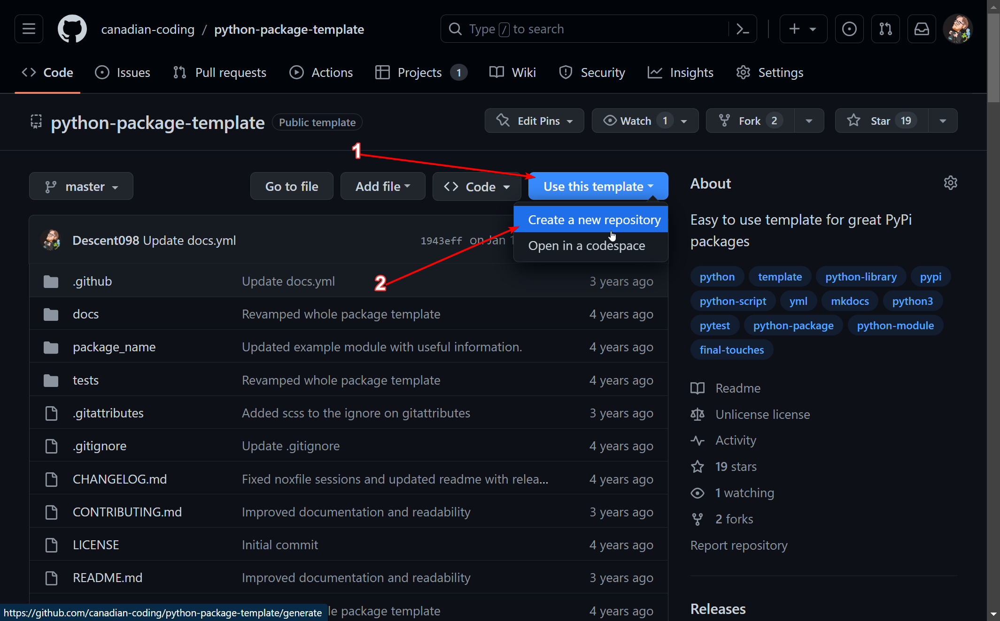

# Post 0; Project setup

We need to get some of the boring stuff out of the way first. I want to create this project so it can be installed and messed with easily. With python you install packages with pip.

## How pip works

Pip works with specially formatted python packages to install them to be used on your system. These packages can be stored locally and installed from source files (projects that have a `setup.py`), or they can be installed remotely from [pypi](https://pypi.org/). 

This format has a bunch of stuff that goes into it, so instead of going through everything we're going to use a template. Specifically we're going to use [this template](https://github.com/canadian-coding/python-package-template) I created a while back. It's a bit older, but works well for projects like this. If you are following along (or just interested), you can either download a zip of the code, or if you have a github account you can copy the files as a template directly by hitting `Use this Template`:



## Customizing the template

This template gives you **a ton** of features, we don't need a bunch, so I'm going to delete a bunch of the files. After getting rid of them our project looks like this:

```
├── 📁.github/
│   └── 📁workflows/
│       ├── 📃release.yml
│       └── 📃test-suite.yml
├── 📁hhttpp/
│   ├── 📄__init__.py
│   ├── 📄__main__.py
│   ├── 📄classes.py
│   └── 📄cli.py
├── 📁tests/
│   └── 📄classes_test.py
├── 🗋.gitignore
├── 📃README.md
└── 📄setup.py
```

So a quick breakdown for now we won't need to worry about `📁.github/`, `📁tests/`, or `🗋.gitignore`. 

So to start with `📄setup.py` is the file where we will configure our project so it can be installed and how python should treat it when it's installed. We won't need to touch this file anymore after the initial setup!

Now onto the good stuff. `📁hhttpp/` contains all the code that will be part of our package. We have 4 files inside:

- 📄\_\_init\_\_.py; Just a required file to be able to install the package, there's nothing in there except a version indicaor
- 📄\_\_main\_\_.py; Allows people to run the server using `python -m hhttpp`
- 📄classes.py; Contains our classes that define our HTTP server
- 📄cli.py; Will be filled out later, but will contain code to let people use the CLI

This sets us up well for being able to start building our package!
