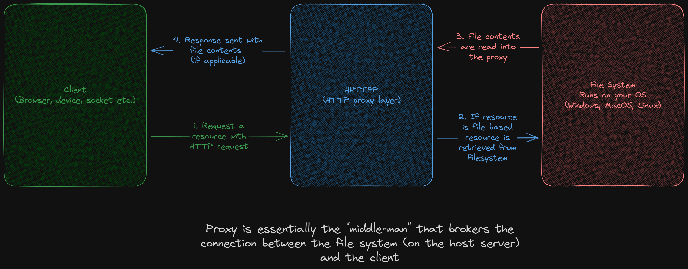

# Handmade HTTP Project (HHTTPP)
## Free range artisnal HTTP

A simple HTTP proxy server designed for educational purposes.

---
**THIS SYSTEM IS NOT DESIGNED FOR PRODUCTION USE**
---

The overall goal with the project is to create a simple [HTTP proxy server](#what-is-an-http-proxy). It is **not** designed to be a framework with routing, or any other fancy features. 

On top of that, there are a few caveats:

1. It will only support **parts** of the HTTP 1.1 spec (just enough to work for basic use)
2. It will only support a portion of the HTTP response codes
3. It will not have optimizations like caching or multithreading


## What is an HTTP proxy? (TODO)

A proxy server in this context is a server that will allow you to access the files in a given folder (called the proxy folder) over HTTP. So essentially when you access a URL on the Proxy it will treat the slug as a path to a file. So for example if you have a proxy folder:

```
📁proxy_folder/
├── 📁blog/
│   └── 📄how-to-make-alfredo.html
└── 📄 about.html
```
Then if it's proxied to `ignite.com` if you go to `ignite.com/about` it will send you the contents of `proxy_folder/about.html` over HTTP. Same thing if you went to `ignite.com/blog/how-to-make-alfredo.html` would give you the content of `proxy_folder/blog/how-to-make-alfredo.html` via HTTP: 



## Order of development

In order to get things to work we will first implement the HTTP information **without** real networking, once we have an HTTP implementation that works without networking, we will cover networking. The reason we do things this way is because it seperates the complexity so that we aren't troubleshooting HTTP **AND** networking at the same time. Once we have the "language" (protocol) we're going to talk in, then we'll focus on how to "speak" it (send network requests).

So the series will roughly be in this order for the posts (0 is this post):

0. Getting the project setup; Getting the boring python packaging bits out of the way
1. Create request and response objects to house our info
   - Status codes
   - MIME types
2. Use request and response objects to generate proper request/response headers and content encoding
3. Definining a CLI (command line interface); Lets people use our system more easily
4. Implementing the networking portion
